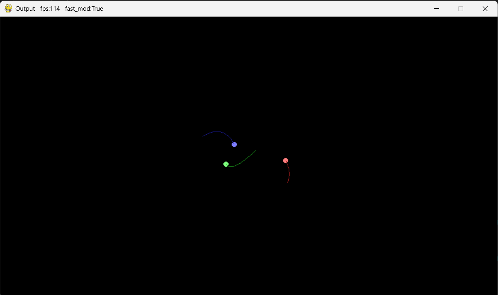

# Python 語言實作內容概述

---

**二下自主學習專題_天體運動二維模擬與預測**

main.py程式概述：
* 引用tracker.py作為質點預測程式庫
* 使用pygame函式庫作質點數據可視化
* 類別Ball定義質點物理性質及是否受引力影響
* 以簡化韋爾萊積分法進行加速度的運算，減少時間不連續性的加速度誤差
* 前綴fix_的重力運算函式以numpy運算速度的優勢改善多質點的運算效能問題
* 定義三種天體模式加入主函式手動修改

tracker.py程式概述：
* 使用修改版卡爾曼濾波（統稱KFA）理論預測非線性數據
* 規定輸入與輸出質點座標格式
* 紀錄歷史座標資料用於下一次預測

---

**三維模擬.py**

參考OpenGL空間投影邏輯，以平面遊戲開發程式庫pygame繪製空間座標：
* 類別Point定義立方體頂點屬性
* model_matrix作為物件基本行為定義（程式中未描寫物件行為）
* view_matrix定義相機行為（輸出相機的xy座標軸作為視角變動依據）
* projection_matrix描述透視投影邏輯
* 點更新及繪製邊緣（尚未以質點深度排序更新順序）
* mov定義相機移動邏輯
* mouse_mov定義視角變動邏輯（以滑鼠向量做view_matrix輸出之相機xy軸分量）
* 主迴圈執行矩陣運算與事件偵測
